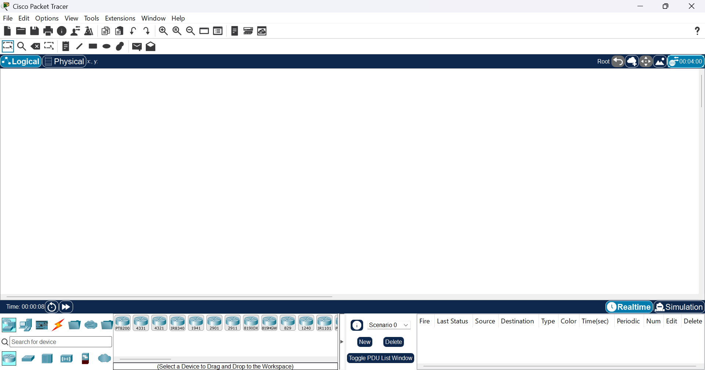
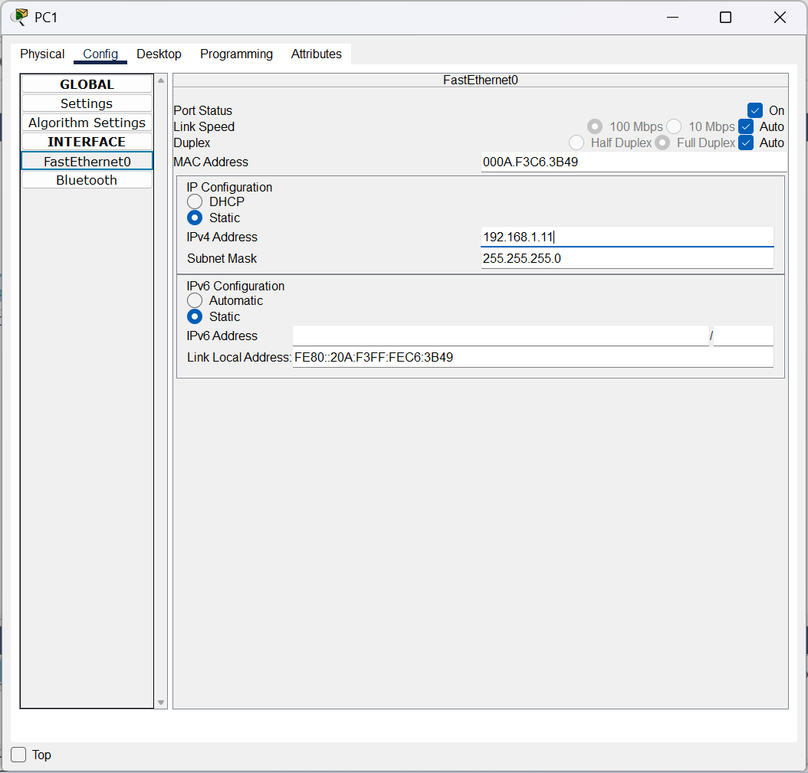
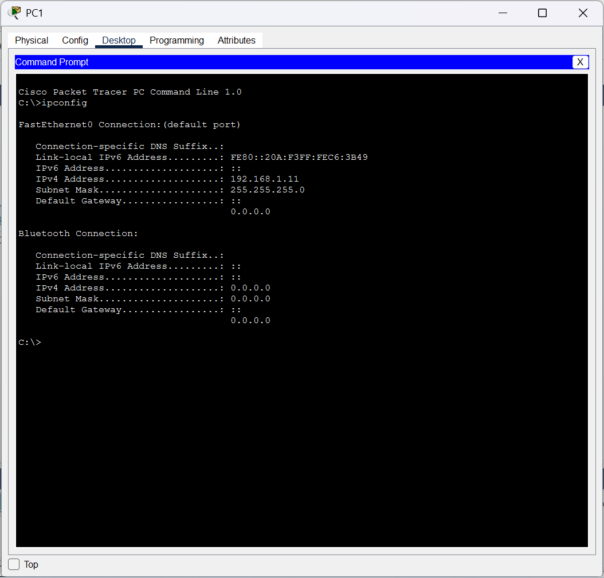
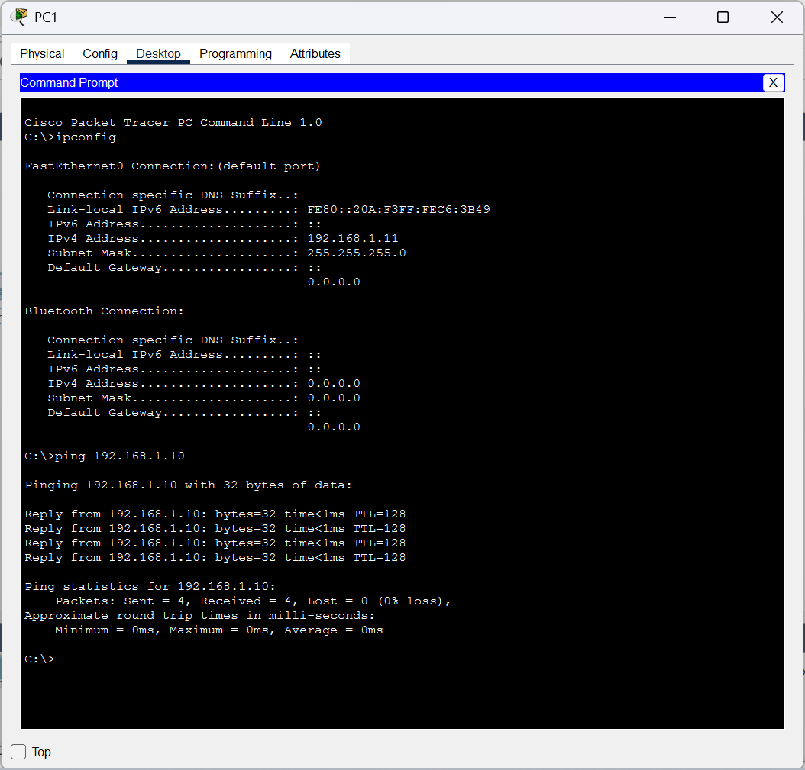

# Packet-Tracer
## Created a Simple Network with Cisco Packet Tracer
Installed Packet Tracer

Configured a static ip address and subnet mask both on PC 1 and PC 2

Utilised CLI and verified IP adress for PC 2 with ipconfig command

Tested connectivity with the Ping command

